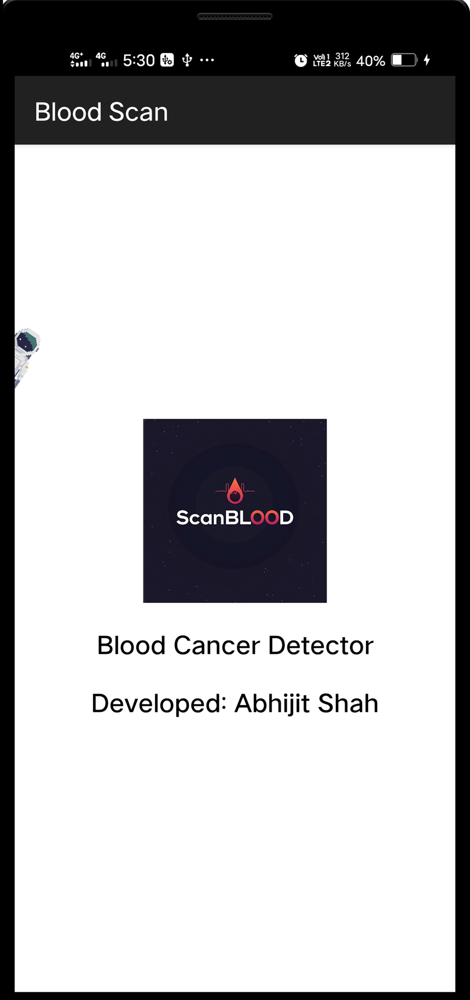
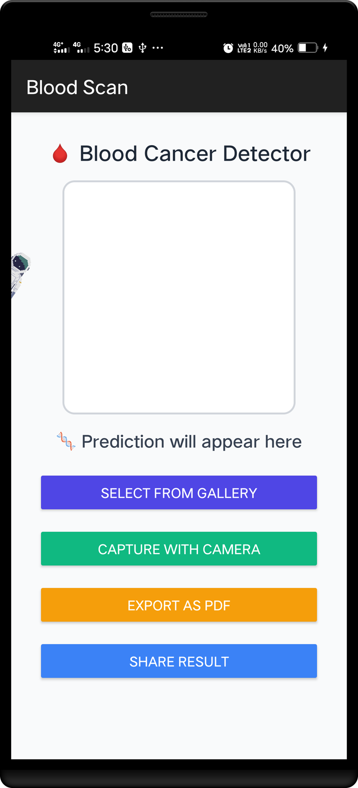
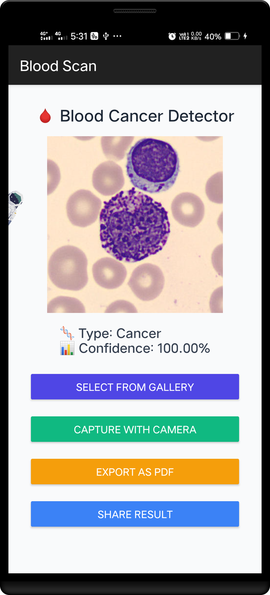
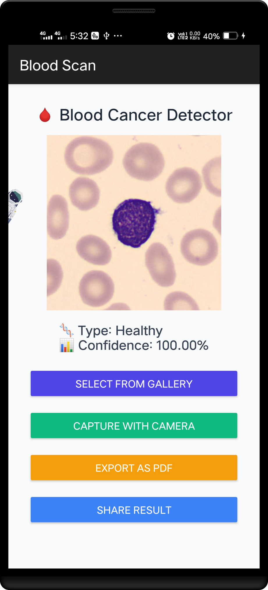
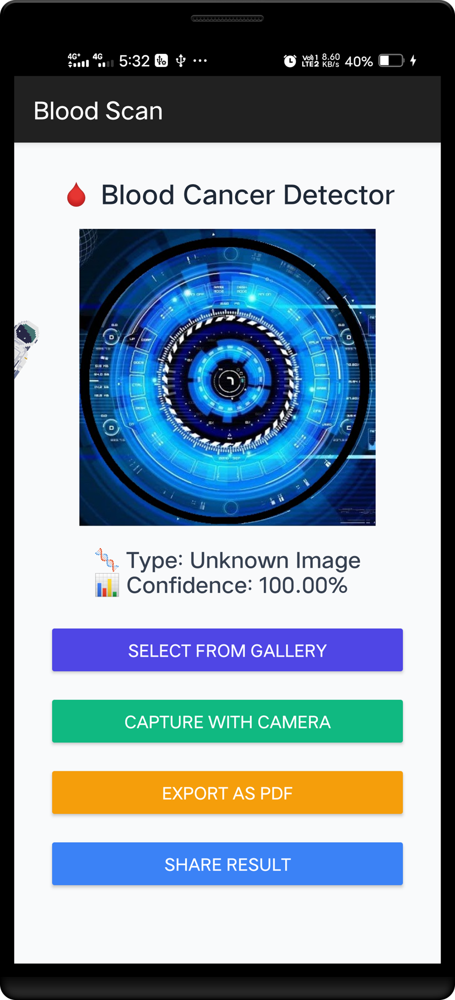
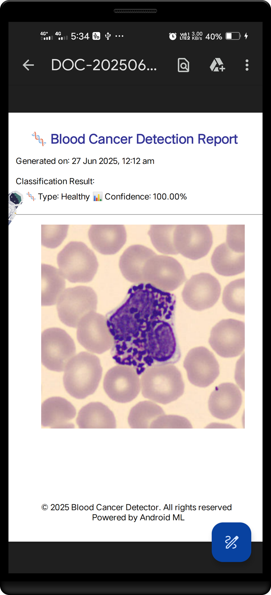

# 🧬 Blood_Cancer_Detector

A lightweight Android application for detecting blood cancer using a deep learning model trained via **AutoKeras** and deployed with **TensorFlow Lite**. The app allows users to capture or upload blood smear images and instantly get a diagnosis — all offline.

---

## 📱 Features

- 📷 Capture or upload blood smear images
- 🤖 On-device classification: `Healthy` or `Cancer`
- 📊 Displays confidence score
- 📄 Exports detailed PDF report with image and result
- 📤 Share report directly from the app
- 🚫 Works fully offline (no internet required)

---

## 🖼️ Screenshots

<p float="left">
  
  
  
  
  
  
</p>

---

## 🧠 Model Info

- Framework: **AutoKeras**
- Input Size: `224x224`
- Exported Format: `.tflite`
- Output Classes: `Healthy`, `Cancer`, `Unknown`

---

## 🚀 Getting Started

1. Clone the repository:
   ```bash
   git clone https://github.com/your-username/Blood_Cancer_Detector.git
